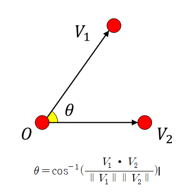
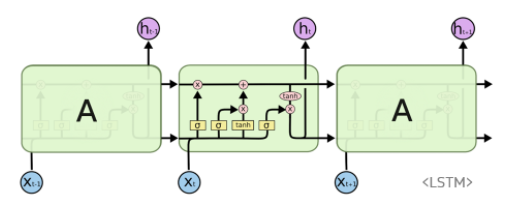
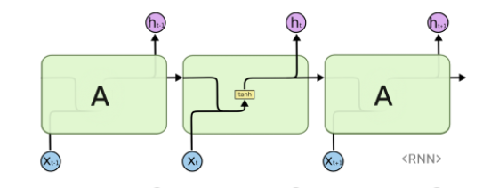
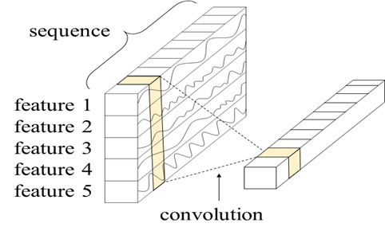
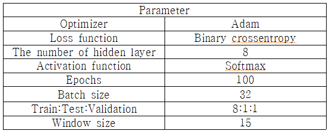
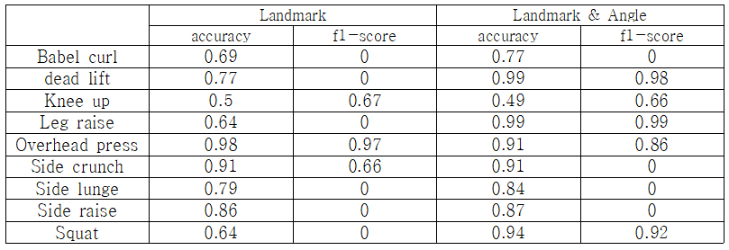
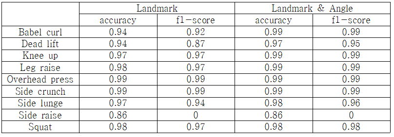
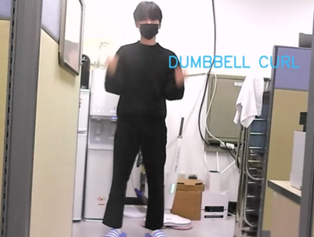
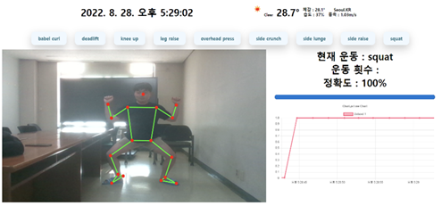

# 딥러닝 기반 운동 추천과 행동 인식 시스템

* KWIX 2022  
  KWIX는 광운대학교 학부생과 교수로 구성된 KWIX팀이 주어진 연구 목표를 달성하기 위해 1년간 연구 개발한 결과를 발표하고 전시하는 행사입니다.

---

## 내용

  사용자의 메타 데이터를 입력받아 사용자에게 적합한 운동을 추천해주고, 추천한 운동을 인식할 수 있는 알고리즘을 개발한다.  

---

## 나의 프로젝트 기여

### 행동 인식

* 딥러닝 기반 행동 인식 시스템
  * RNN
  * LSTM

추천 부분에는 기여하지 않아, 기술에 대해 설명하지 않는다.

---

## 연구 내용

### Dataset

  

  [AI hub](https://aihub.or.kr/) 링크

  행동 인식 모델에서 학습하기 위한 이미지 데이터로는 AI hub의 피트니스 운동 자세 이미지를 사용했다. AI hub 피트니스 운동 이미지 데이터는 연속된 사진 형태로 데이터를 제공하며, 여러 종류의 운동 데이터가 있다. 학습에서 사용한 총 이미지 수는 각 운동별 평균 2300장을 사용했다.

  

  mediapipe pose는 사람을 인식하기 위해 총 33개의 관절 포인트(landmark)를 출력해준다. 각 관절 포인트들은 x, y, z 좌표를 반환한다. 33개의 관절 포인트 중 운동 자세에서 중요한 관절 포인트 정보들만 학습 데이터로 사용했다. mediapipe pose의 얼굴 좌표와 손가락 좌표는 운동 자세를 분석하는데 중요하지 않은 정보들이고 학습에 방해될 수 있기 때문에, 얼굴을 인식하는 1부터 10번까지의 좌표 정보와 손가락 인식하는 17부터 22번까지의 좌표 정보들을 제거하였다. 최종적으로 사용한 관절 좌표는 총 17개이다.  

### Data preprocessing

  >

  관절 좌표만을 사용한 데이터는 상대적으로 분류 성능이 떨어지기 때문에, 관절의 각도 정보도 학습 데이터로 사용했다. 관절 좌표 정보에서 추출된 x, y, z 좌표를 이용하여 각 관절의 각도를 계산하는 알고리즘을 구현했다 (세 점 사이의 각도를 구하기 위해서 두 직선의 벡터를 외적 연산을 한다). 관절의 각도는 운동을 분석할 때 중요한 정보로 사용된다. 팔꿈치, 어깨, 골반, 무릎, 발목 총 10개의 각도 정보를 추출하여 운동을 분류하는 성능을 높일 수 있었다. 또한 1~180도로 이루어진 각도 정보 데이터를 Normalizer를 이용해 scaling 해주었다.  

---

### Model

  데이터가 관절의 좌표와 각도가 시간에 따라 변하는 sequential data의 형태로 이루어져 있다. 이러한 sequential data를 분석하는데 RNN과 LSTM을 이용한 모델이 적합하다고 생각해 적용했다.

* RNN
    
  RNN은 시계열 데이터를 입력으로 사용한다. 대표적인 예시로는 자연어 처리 분야로 번역기 혹은 음성 처리 분야에서 응용된다. RNN은 출력이 다음 은닉층의 입력으로 들어가 순환되는 구조를 가지고 있다.  

* LSTM
    
  LSTM은 RNN의 문제점인 기울기 소실 및 폭발 문제를 해결하기 위해 고안된 모델이다.  

* CNN
    
  CNN은 여러 필터를 통해 학습 데이터의 특징을 추출하는 네트워크이다. 행렬 입력과 필터의 합성곱을 순차적으로 진행하여 contextual information을 얻어 필터를 학습한다. Contextual information을 추출하는 특징 때문에 CNN은 주로 이미지 데이터를 학습할 때 사용한다.  

---

### 실험

#### 평가지표

  행동 인식 모델을 평가하는 지표로써 accuracy와 f1-score를 사용한다.  
  Accuracy와 f1-score를 수식적으로 나타내면 다음과 같다.  

  $accuracy= {TP+TN} over {TP+TN+FP+FN}$  

  $f1-score=2 TIMES  {"precision" TIMES "recall"} over {"precision"+"recall"}$  

  $precision= { TP} over {TP+FP }$

  $recall= { TP} over {TP+FN }$  

  TP(true positive)는 positive 데이터를 예측 성공한 경우를 뜻하고, TN(true negative)는 negative 데이터를 예측 성공한 경우를 뜻한다. FP(false positive)는 positive 데이터를 예측 실패한 경우를 뜻하고, FN(false negative)는 negative 데이터를 예측 실패한 경우를 뜻한다. Accuracy는 실제 데이터와 예측 데이터가 얼마나 같은지를 확인하는 지표이다. 본 연구에서 사용한 데이터는 올바른 데이터(ex 완벽한 팔굽혀펴기 자세)와 불량한 데이터(ex 엉덩이가 너무 내려간 팔굽혀펴기)가 약 1:3 비율인 데이터를 사용하였다(AI hub 자체에서 불량한 자세 데이터의 수를 훨씬 많이 제공하며, 바른 자세 데이터로만은 학습하기에 데이터가 부족한 점과 실제 서비스를 사용할 사용자들은 자세가 완벽하지 않을 가능성이 많기에 두 데이터를 섞어서 학습시켰다). 모든 데이터를 불량한 데이터로 예측할 경우 accuracy는 높지만, 실제 구현단계에서 인식을 잘 못하는 문제가 발생하기 때문에 f1-score도 평가 지표로 사용하였다.

#### 하이퍼 파라미터

  

  시계열 데이터에서 window size는 중요한 파라미터이다. 본 행동 인식 실험에서 학습한 운동 자세는 총 9가지를 사용했다. 각 운동마다 1회 반복하는데 필요한 프레임 수가 다르기 때문에 window size를 각 운동 자세의 최소 1회 반복 시간으로 설정하였다. 과적합을 막기 위해 early-stopping 옵션을 설정하였고, dropout layer를 각 층마다 배치하였다. 마지막 출력층의 활성화 함수를 softmax를 사용하여 자세의 분류 정확도를 출력하였다.  

#### 실험 결과

* RNN
  
  landmark는 좌표 정보만을 학습했을 때의 결과이고, landmark & angle은 좌표 정보와 각도 정보를 모두 학습한 경우를 뜻한다. 관절 좌표에 각도를 추가하여 학습한 결과는 관절 좌표만 학습한 결과보다 좋은 성능을 확인할 수 있다. F1-score가 0인 모델은 올바른 데이터를 전혀 예측하지 못한 경우이다. 불량한 데이터의 수가 올바른 데이터 수보다 2배 이상 많기 때문에 accuracy는 높게 나타난 대신 f1-score는 0으로 나왔다. 기울기 소실 및 폭발 문제가 발생한 것으로 예상한다.  

* LSTM
  
  RNN 모델에 비해 기울기 소실 문제를 해결하여 높은 성능을 보인 것으로 확인된다. 그러나 특정 운동의 f1-score는 0으로 기울기 소실 문제가 완전히 해결되지 않았다는 것을 알 수 있다.  

* CNN
  
  CNN 모델의 성능이 가장 좋다는 것을 확인할 수 있다. 각도 정보를 추가한 모델의 f1-score가 2.7% 증가함을 알 수 있다. 최종적으로 CNN 모델의 성능이 가장 좋다는 것을 확인하였다.
  본 연구에서 사용한 시계열 데이터는 각 관절들의 좌표들로 이루어져 데이터들 간의 관계가 존재한다. 예를 들어 사용자가 좌측으로 움직이면, 모든 좌표들이 움직임에 따라 값이 변화하게 된다. 또한, 특정 각도가 변하면, 그 각도와 관계된 다른 각도가 변한다. 일반적으로 시계열 데이터를 CNN 모델로 학습하는 경우는 흔하지 않다. 그러나 본 연구에서 사용한 데이터들은 서로 상관관계를 가지므로 CNN의 contextual information을 추출하는 특징 때문에 가장 좋은 성능을 보인 것으로 예상한다.

---

### 구현

  파이썬 코드 실행  

    

  제안한 모델들을 활용하여 웹사이트에 구현하였다.  

    
    

---

## 결론

  이 프로젝트에서는 시계열 데이터를 활용하여 운동 자세 교정 시스템을 위한 적합한 모델을 제안했다. AI-hub의 피트니스 이미지를 mediapipe pose를 통하여 분석했다. 좌표 정보를 토대로 각도 정보를 계산하여 학습 데이터로 사용했으며, 3개의 딥러닝 모델에 따른 성능을 평가했다. 학습하는 이미지의 수가 불균형하기 때문에 f1-score를 평가지표로 사용했고, CNN 모델이 RNN 모델과 LSTM 모델에 비해 분류 정확도가 각각 48%, 11% 높은 성능을 보이는 것을 확인했다. 향후 연구로써, 카메라 외의 동작, 자이로 센서와 같은 복합적인 센서 정보를 활용할 경우, 사용자의 운동 자세를 더 정확하게 분류해 행동 인식 서비스에 활용될 수 있을 것으로 예상한다.

---

## 국내 논문 출허

> B. Hwang, J. Kim, Y. R. Lee, C. Kyeong, J. Seon, Y. G. Sun, and J. Y. Kim, “Performance of exercise posture correction system based on deep learning,” The Journal of The Institute of Internet, Broadcasting and Communication (J. IIBC), vol. 22, no. 5, pp.177-183, Oct. 2022.
