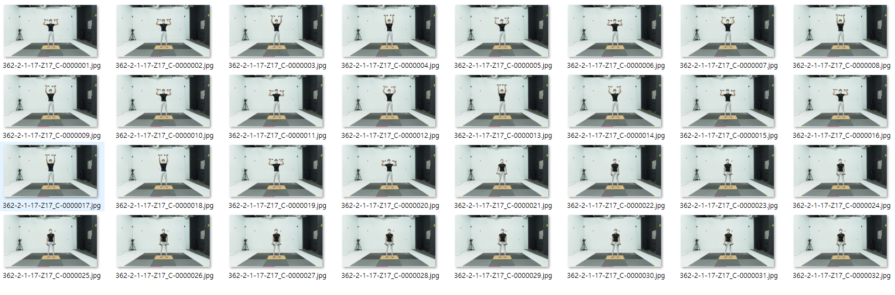
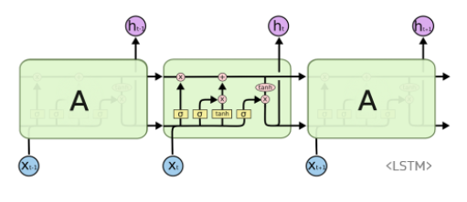
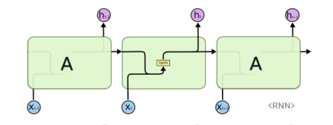

## KWIX 2022

KWIX는 광운대학교 학부생과 교수로 구성된 KWIX팀이 주어진 연구 목표를 달성하기 위해 1년간 연구 개발한 결과를 발표하고 전시하는 행사입니다.

### 주제

딥러닝 기반 운동 추천과 행동 인식 시스템

### 내용

사용자의 메타 데이터를 입력받아 사용자에게 적합한 운동을 추천해주고, 추천한 운동을 인식할 수 있는 알고리즘을 개발한다.  

### 나의 프로젝트 기여

#### 행동 인식

* 딥러닝 기반 행동 인식 시스템
  * RNN
  * LSTM

### 연구 내용

#### Dataset

[AI hub](https://aihub.or.kr/)

행동 인식 모델에서 학습하기 위한 이미지 데이터로는 AI hub의 피트니스 운동 자세 이미지를 사용했다. AI hub 피트니스 운동 이미지 데이티는 연속된 사진 형태로 데이터를 제공하며, 여러 종류의 운동 데이터가 있다. 학습에서 사용한 총 이미지 수는 각 운동별 평균 2300장을 사용했다.

mediapipe pose는 사람을 인식하기 위해 총 33개의 관절 포인트(landmark)를 출력해준다. 각 관절 포인트들은 x, y, z 좌표를 반환한다. 33개의 관절 포인트 중 운동 자세에서 중요한 관절 포인트 정보들만 학습 데이터로 사용했다. mediapipe pose의 얼굴 좌표와 손가락 좌표는 운동 자세를 분석하는데 중요하지 않은 정보들이고 학습에 방해될 수 있기 때문에, 얼굴을 인식하는 1부터 10번까지의 좌표 정보와 손가락 인식하는 17부터 22번까지의 좌표 정보들을 제거하였다. 최종적으로 사용한 관절 좌표는 총 17개이다.

#### Data preprocessing

관절 좌표만을 사용한 데이터는 상대적으로 분류 성능이 떨어지기 때문에, 관절의 각도 정보도 학습 데이터로 사용했다. 관절 좌표 정보에서 추출된 x, y, z 좌표를 이용하여 각 관절의 각도를 계산하는 알고리즘을 구현했다 (세 점 사이의 각도를 구하기 위해서 두 직선의 벡터를 외적 연산을 한다). 관절의 각도는 운동을 분석할 때 중요한 정보로 사용된다. 팔꿈치, 어깨, 골반, 무릎, 발목 총 10개의 각도 정보를 추출하여 운동을 분류하는 성능을 높일 수 있었다. 또한 1~180도로 이루어진 각도 정보 데이터를 Normalizer를 이용해 scaling 해주었다.

#### Model

데이터가 관절의 좌표와 각도가 시간에 따라 변하는 sequential data의 형태로 이루어져 있다. 이러한 sequential data를 분석하는데 RNN과 LSTM을 이용한 모델이 적합하다고 생각해 적용했다.

