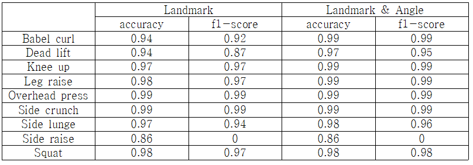

## KWIX 2022

KWIX는 광운대학교 학부생과 교수로 구성된 KWIX팀이 주어진 연구 목표를 달성하기 위해 1년간 연구 개발한 결과를 발표하고 전시하는 행사입니다.

---

# 딥러닝 기반 운동 추천과 행동 인식 시스템

---

## 내용

사용자의 메타 데이터를 입력받아 사용자에게 적합한 운동을 추천해주고, 추천한 운동을 인식할 수 있는 알고리즘을 개발한다.  

---

## 나의 프로젝트 기여

### 행동 인식

* 딥러닝 기반 행동 인식 시스템
  * RNN
  * LSTM

추천 부분에는 기여하지 않아, 기술에 대해 설명하지 않는다.

---

## 연구 내용

### Dataset

[AI hub](https://aihub.or.kr/)

행동 인식 모델에서 학습하기 위한 이미지 데이터로는 AI hub의 피트니스 운동 자세 이미지를 사용했다. AI hub 피트니스 운동 이미지 데이티는 연속된 사진 형태로 데이터를 제공하며, 여러 종류의 운동 데이터가 있다. 학습에서 사용한 총 이미지 수는 각 운동별 평균 2300장을 사용했다.

mediapipe pose는 사람을 인식하기 위해 총 33개의 관절 포인트(landmark)를 출력해준다. 각 관절 포인트들은 x, y, z 좌표를 반환한다. 33개의 관절 포인트 중 운동 자세에서 중요한 관절 포인트 정보들만 학습 데이터로 사용했다. mediapipe pose의 얼굴 좌표와 손가락 좌표는 운동 자세를 분석하는데 중요하지 않은 정보들이고 학습에 방해될 수 있기 때문에, 얼굴을 인식하는 1부터 10번까지의 좌표 정보와 손가락 인식하는 17부터 22번까지의 좌표 정보들을 제거하였다. 최종적으로 사용한 관절 좌표는 총 17개이다.

### Data preprocessing

>

관절 좌표만을 사용한 데이터는 상대적으로 분류 성능이 떨어지기 때문에, 관절의 각도 정보도 학습 데이터로 사용했다. 관절 좌표 정보에서 추출된 x, y, z 좌표를 이용하여 각 관절의 각도를 계산하는 알고리즘을 구현했다 (세 점 사이의 각도를 구하기 위해서 두 직선의 벡터를 외적 연산을 한다). 관절의 각도는 운동을 분석할 때 중요한 정보로 사용된다. 팔꿈치, 어깨, 골반, 무릎, 발목 총 10개의 각도 정보를 추출하여 운동을 분류하는 성능을 높일 수 있었다. 또한 1~180도로 이루어진 각도 정보 데이터를 Normalizer를 이용해 scaling 해주었다.

### Model

데이터가 관절의 좌표와 각도가 시간에 따라 변하는 sequential data의 형태로 이루어져 있다. 이러한 sequential data를 분석하는데 RNN과 LSTM을 이용한 모델이 적합하다고 생각해 적용했다.

RNN

LSTM

### 성능

#### 평가지표

행동 인식 모델을 평가하는 지표로써 accuracy와 f1-score를 사용한다. Accuracy와 f1-score를 수식적으로 나타내면 다음과 같다.  
$accuracy= {TP+TN} over {TP+TN+FP+FN}$  
$f1-score=2 TIMES  {"precision" TIMES "recall"} over {"precision"+"recall"}$  

행동 인식 모델에서 사용한 데이터는 올바른 데이터(ex 완벽한 팔굽혀펴기 자세)와 불량한 데이터(ex 엉덩이가 너무 내려간 팔굽혀펴기)가 약 1:3 비율인 데이터를 사용하였다. AI hub 자체에서 불량한 자세 데이터의 수를 훨씬 많이 제공한다. 바론 자세 데이터로만은 학습하기에 데이터가 부족한 점과 실제 서비스를 사용할 사용자들은 자세가 완벽하지 않을 가능성이 많기에 두 데이터를 섞어서 학습시켰다. 모든 데이터를 불량한 데이터로 예측할 경우 accuracy는 높지만, 실제 구현단계에서 인식을 잘 못하는 문제가 발생하기 때문에 f1-score도 평가 지표로 사용하였다.

#### 하이퍼 파라미터

시계열 데이터에서 window size는 중요한 파라미터이다. 본 행동 인식 실험에서 학습한 운동 자세는 총 9가지를 사용했다. 각 운동마다 1회 반복하는데 필요한 프레임 수가 다르기 때문에 window size를 각 운동 자세의 최소 1회 반복 시간으로 설정하였다. 과적합을 막기 위해 early-stopping 옵션을 설정하였고, dropout layer를 각 층마다 배치하였다. 마지막 출력층의 활성화 함수를 softmax를 사용하여 자세의 분류 정확도를 출력하였다.

#### 실험 결과

##### RNN

landmark는 좌표 정보만을 학습했을 때의 결과이고, landmark & angle은 좌표 정보와 각도 정보를 모두 학습한 경우를 뜻한다. 관절 좌표에 각도를 추가하여 학습한 결과는 관절 좌표만 학습한 결과보다 좋은 성능을 확인할 수 있다. F1-score가 0인 모델은 올바른 데이터를 전혀 예측하지 못한 경우이다. 불량한 데이터의 수가 올바른 데이터 수보다 2배 이상 많기 때문에 accuracy는 높게 나타난 대신 f1-score는 0으로 나왔다. 기울기 소실 및 폭발 문제가 발생한 것으로 예상한다.

##### LSTM

RNN 모델에 비해 기울기 소실 문제를 해결하여 높은 성능을 보인 것으로 확인된다. 그러나 특정 운동의 f1-score는 0으로 기울기 소실 문제가 완전히 해결되지 않았다는 것을 알 수 있다.

##### CNN

CNN 모델의 성능이 가장 좋다는 것을 확인할 수 있다. 각도 정보를 추가한 모델의 f1-score가 약 1% 증가함을 알 수 있다. 최종적으로 CNN 모델의 성능이 가장 좋다는 것을 확인했다.
본 논문에서 사용한 시계열 데이터는 각 관절들의 좌표들로 이루어져 데이터들 간의 관계가 존재한다. 예를 들어 사용자가 좌측으로 움직이면, 모든 좌표들이 움직임에 따라 값이 변화하게 된다. 또한, 특정 각도가 변하면, 그 각도와 관계된 다른 각도가 변한다. 일반적으로 시계열 데이터를 CNN 모델로 학습하는 경우는 흔하지 않다. 그러나 본 논문에서 사용한 데이터들은 서로 상관관계를 가지므로 CNN의 contextual information을 추출하는 특징 때문에 가장 좋은 성능을 보인 것으로 예상한다.

### 구현

파이썬 코드 실행  

제안한 모델들을 활용하여 웹사이트에 구현하였다.  
  

### 결론

이 프로젝트에서는 시계열 데이터를 활용하여 운동 자세 교정 시스템을 위한 적합한 모델을 제안했다. AI-hub의 피트니스 이미지를 mediapipe pose를 통하여 분석했다. 좌표 정보를 토대로 각도 정보를 계산하여 학습 데이터로 사용했으며, 3개의 딥러닝 모델에 따른 성능을 평가했다. 학습하는 이미지의 수가 불균형하기 때문에 f1-score를 평가지표로 사용했고, CNN 모델이 RNN 모델과 LSTM 모델에 비해 분류 정확도가 각각 48%, 11% 높은 성능을 보이는 것을 확인했다. 향후 연구로써, 카메라 외의 동작, 자이로 센서와 같은 복합적인 센서 정보를 활용할 경우, 사용자의 운동 자세를 더 정확하게 분류해 행동 인식 서비스에 활용될 수 있을 것으로 예상한다.
